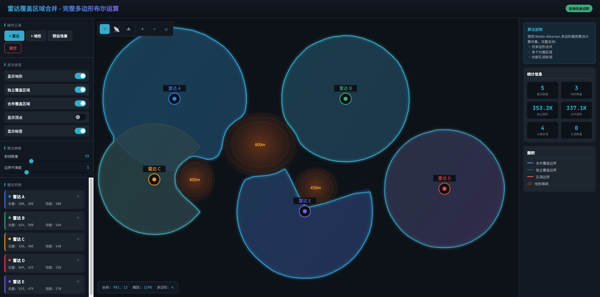

# Radar Coverage Merge

[](https://opensource.org/licenses/MIT)
[](https://isocpp.org/)

多部雷达探测覆盖区域合并算法实现，支持地形遮挡计算和凹多边形布尔运算。



## 特性

- ✅ **真正的多边形布尔运算** - 基于 Clipper2 库，完整支持凹多边形
- ✅ **地形遮挡计算** - 射线追踪 + 视线分析
- ✅ **孔洞检测** - 自动识别覆盖盲区
- ✅ **多分离区域** - 正确处理不连通的覆盖区域
- ✅ **后处理算法** - Douglas-Peucker 简化 + Chaikin 平滑
- ✅ **多种导出格式** - SVG / GeoJSON / WKT
- ✅ **交互式可视化** - 网页版测试工具

## 在线演示

直接在浏览器中打开 `demo/radar-coverage-visualizer.html` 即可体验交互式演示。

## 目录结构

```
radar-coverage-merge/
├── include/                    # C++ 头文件
│   ├── polygon_boolean.hpp     # 多边形布尔运算 (Clipper2)
│   └── radar_coverage.hpp      # 雷达覆盖计算
├── src/                        # C++ 源文件
│   └── main.cpp                # 示例程序
├── demo/                       # 网页演示
│   ├── radar-coverage-visualizer.html    # 基础版
│   └── radar-coverage-complete.html      # 完整版 (支持凹多边形)
├── docs/                       # 文档
│   ├── ALGORITHM.md            # 算法详解
│   ├── INTEGRATION.md          # 集成指南
│   └── images/                 # 文档图片
├── tests/                      # 单元测试
├── CMakeLists.txt              # CMake 构建配置
├── LICENSE                     # MIT 许可证
└── README.md                   # 本文件
```

## 快速开始

### 方式一：网页演示（无需安装）

```bash
# 克隆仓库
git clone https://github.com/YOUR_USERNAME/radar-coverage-merge.git
cd radar-coverage-merge

# 直接用浏览器打开
open demo/radar-coverage-complete.html
# 或
xdg-open demo/radar-coverage-complete.html  # Linux
```

### 方式二：C++ 编译

#### 依赖

- C++17 编译器 (GCC 7+ / Clang 5+ / MSVC 2017+)
- CMake 3.14+
- [Clipper2](https://github.com/AngusJohnson/Clipper2) (自动下载或手动安装)

#### 编译

```bash
# 克隆仓库
git clone https://github.com/YOUR_USERNAME/radar-coverage-merge.git
cd radar-coverage-merge

# 创建构建目录
mkdir build && cd build

# 配置 (自动下载 Clipper2)
cmake ..

# 编译
make -j4

# 运行示例
./radar_coverage_demo
```

#### 手动安装 Clipper2

```bash
git clone https://github.com/AngusJohnson/Clipper2.git
cd Clipper2/CPP
mkdir build && cd build
cmake ..
make && sudo make install
```

## 使用示例

### C++ API

```cpp
#include "polygon_boolean.hpp"
#include "radar_coverage.hpp"

using namespace polygon_ops;
using namespace radar_coverage;

int main() {
    // 1. 创建地形模型
    TerrainModel terrain;
    terrain.addObstacle({{400, 300}, 80, 60, 500});  // 中央山脉
    
    // 2. 配置雷达
    std::vector<RadarParams> radars = {
        {1, "Radar A", {200, 200}, 180, 100},
        {2, "Radar B", {600, 200}, 160, 80},
    };
    
    // 3. 生成覆盖多边形
    std::vector<Polygon> coverages;
    for (const auto& radar : radars) {
        coverages.push_back(generateCoveragePolygon(radar, terrain));
    }
    
    // 4. 计算并集
    MultiPolygon merged = PolygonBoolean::unionAll(coverages);
    
    // 5. 输出统计
    auto stats = PolygonStats::compute(merged);
    std::cout << "分离区域: " << stats.regionCount << std::endl;
    std::cout << "孔洞数量: " << stats.totalHoleCount << std::endl;
    std::cout << "总面积:   " << stats.totalArea << std::endl;
    
    return 0;
}
```

### JavaScript (网页版)

```javascript
// 生成覆盖多边形
const coverage = generateCoveragePolygon(radar, terrain, 72);

// 计算并集
const result = PolygonBoolean.union(polygons);

// 结果包含外边界和孔洞
console.log('区域数:', result.regions.length);
console.log('孔洞数:', result.holes.length);
```

## 算法说明

### 核心算法

| 步骤 | 算法 | 复杂度 |
|------|------|--------|
| 视线遮挡 | 射线追踪 + 二分搜索 | O(n·m) |
| 多边形并集 | Vatti 裁剪 (Clipper2) | O(n log n) |
| 边界简化 | Douglas-Peucker | O(n log n) |
| 边界平滑 | Chaikin 细分 | O(n·k) |

### 处理流程

```
雷达参数 + 地形模型
        │
        ▼
┌───────────────────┐
│ 射线追踪          │  对每个方位角计算最大可视距离
│ (考虑地形遮挡)     │
└───────────────────┘
        │
        ▼
┌───────────────────┐
│ 多边形布尔运算     │  Clipper2 并集计算
│ (支持凹多边形)     │
└───────────────────┘
        │
        ▼
┌───────────────────┐
│ 后处理            │  简化 + 平滑
└───────────────────┘
        │
        ▼
  合并后的覆盖区域
  (含孔洞和分离区域)
```

## 导出格式

| 格式 | 用途 | 函数 |
|------|------|------|
| SVG | 网页显示 / 文档 | `exportToSVG()` |
| GeoJSON | GIS 系统 (QGIS, ArcGIS) | `exportToGeoJSON()` |
| WKT | 数据库 (PostGIS) | `exportToWKT()` |

## 性能

| 场景 | 雷达数量 | 顶点总数 | 耗时 |
|------|---------|---------|------|
| 简单 | 3 | ~200 | <5ms |
| 中等 | 10 | ~700 | ~20ms |
| 复杂 | 50 | ~3500 | ~150ms |

*测试环境: Intel i7-10700 / 16GB RAM / GCC 11*

## 相关项目

- [Clipper2](https://github.com/AngusJohnson/Clipper2) - 多边形裁剪库
- [CGAL](https://www.cgal.org/) - 计算几何算法库
- [Boost.Geometry](https://www.boost.org/doc/libs/release/libs/geometry/) - Boost 几何库

## 参考文献

1. Vatti, B. R. (1992). A generic solution to polygon clipping. *Communications of the ACM*.
2. Douglas, D. H., & Peucker, T. K. (1973). Algorithms for the reduction of the number of points required to represent a digitized line. *Cartographica*.
3. Chaikin, G. M. (1974). An algorithm for high-speed curve generation. *Computer Graphics and Image Processing*.

## 贡献

欢迎提交 Issue 和 Pull Request！

## 许可证

[MIT License](LICENSE)

## 作者

[Your Name]

---

如果这个项目对你有帮助，请给一个 ⭐ Star！
